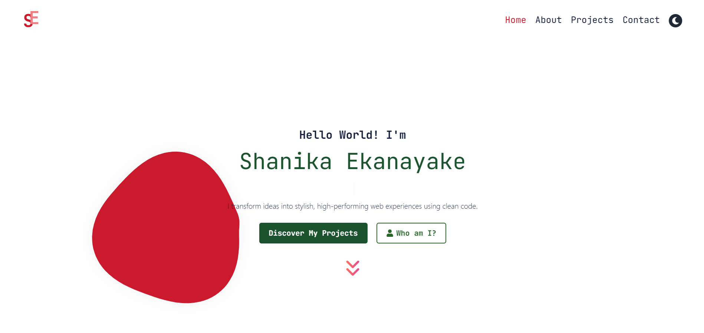

Headless Portfolio
A modern, responsive developer portfolio built with React + Vite, powered by a headless WordPress CMS for content management. This project showcases a list of skills, projects, and categories dynamically fetched from WordPress using the REST API, offering a scalable and flexible architecture ideal for personal branding.

🚀 Tech Stack
Frontend: React, Vite, Tailwind CSS

Backend: WordPress (Headless)

APIs: WordPress REST API

Routing: React Router

State Management: useContext, useReducer

🧩 Key Features
💡 Dynamic Content: Projects and skills are fetched from WordPress custom post types and taxonomies.

🎨 Responsive Design: Optimized for all screen sizes using Tailwind CSS.

⚡ Fast Development: Built with Vite for instant hot module replacement and fast builds.

🔍 SEO-friendly: Metadata ready for search engine indexing.

🌐 Routing: Multi-page structure powered by React Router.

📂 Folder Structure
<pre lang="markdown"> 
├── public/
├── src/
|   ├── assets/
│   ├── components/
│   ├── pages/
│   ├── utils/
│   ├── App.jsx
│   └── main.jsx
├── .eslintrc.cjs
├── tailwind.config.js
├── vite.config.js
└── README.md
  </pre> 

🛠️ Setup & Installation

git clone https://github.com/shanikauwu1/headless-portfolio.git
cd headless-portfolio
npm install
npm run dev

🧪 TODO / Roadmap

 Add TypeScript support
 Implement Unit & Integration Testing (Jest, React Testing Library)

 📸 Live Demo
🔗 https://shanikacode.in/

## 📸 Screenshot

 
